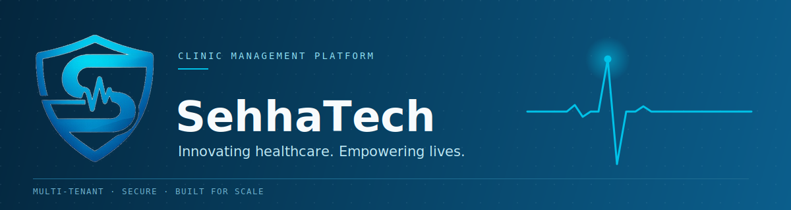

 

 

## About

SehhaTech is a multi-tenant SaaS platform for clinic management — built to give clinics a single, secure system for handling patients, appointments, staff, and records, without the overhead of managing separate infrastructure per clinic.

The platform started as a graduation project under Egypt's **Digital Egypt Pioneers Initiative (DEPI)**, Full Stack .NET Track, where it earned a **distinction grade**. It's now being built out into an independent product.

 

## What it does

- **Multi-tenant architecture** — each clinic's data is isolated on shared infrastructure
- **Role-based dashboards** — dedicated experiences for doctors, receptionists, and admins
- **Patient Portal** — a self-service track with registration, OTP verification, and secure login, running on its own isolated authentication layer
- **Arabic and English, fully bilingual** — complete RTL layout support across every page, not just translated strings

 

## Live demo

The staff-facing web app is live and publicly reachable:

**→ [sehhatech.vercel.app](https://sehhatech.vercel.app/)**

 

## Built with

 

## Repositories

| Repository | What's in it |
|---|---|
| [`SehhaTech`](https://github.com/SehhaTech/SehhaTech) | Backend API, database layer, and staff-facing frontend |

*More repositories will be listed here as the platform grows.*

 

## Working with us

We hold this project to a professional standard, in code and in how the team works together:

| | |
|---|---|
| 📜 | [Code of Conduct](./CODE_OF_CONDUCT.md) |
| 🤝 | [Contributing Guide](./CONTRIBUTING.md) |
| 🔒 | [Security Policy](./SECURITY.md) |

 

## Get in touch

📧 **sehhatech.team@gmail.com**

 

SehhaTech · built by a five-person team turning a graduation project into a real product.

